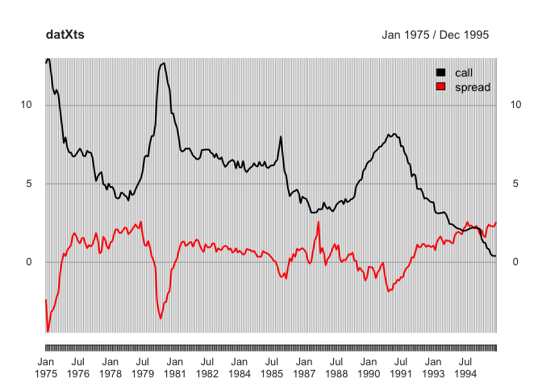
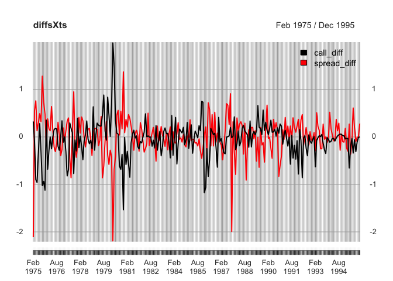

Summary Statistics in Time Series
================

-   [Introduction](#introduction)
-   [Libraries to be used](#libraries-to-be-used)
-   [Importing dataset](#importing-dataset)
-   [Brief look at the data](#brief-look-at-the-data)
-   [Sample mean](#sample-mean)
-   [Variance and covariance](#variance-and-covariance)
-   [Time dependencies](#time-dependencies)
-   [Correlogram](#correlogram)
-   [Ljung-Box test](#ljung-box-test)
-   [First order difference](#first-order-difference)
-   [Summary](#summary)

### Introduction

In this tutorial, you get familiarised with the basic ideas of time series data (autococariation, correalogram, Ljung-Box test, etc, along with manupulation techiniques in xts package), using Japanese financial data from Jan 1975 to Dec 1995. Dataset contains 10-year bond return (end of month), 3-month Tokyo Interbank Offerd Rate (TIBOR) and Collaterised overnight call rate (montly average).

### Libraries to be used

R offers a variety of useful packages for data manupulation including `magrittr` and `tidyverse` (`tidyverse` is a collection of packages such as `dplyr` and `ggplot2`, which are two of my favorite packages in R). For time series analysis, `xts` is very handy. `xts` stands for *extented time series*, which combines matrix/dataframe with time-stamped index.

``` r
library(magrittr)
library(tidyverse)
library(xts)
```

### Importing dataset

Then we import the dataset and compute the spread, which is the difference of 10-year bond return and 3-month TIBOR.

``` r
dat<- read.csv("~/Documents/GitHub/Applied_TimeSeries_Analysis/dat/spreadCall.csv", 
               header=F, skip=2, stringsAsFactors = F) %>% 
  set_colnames(c('date','tenYearBond', 'TIBOR', 'call')) %>% 
  mutate(spread=tenYearBond-TIBOR) 
datXts <- xts(dat[,c(4,5)], order.by = as.yearmon(dat[,1], format="%Y/%m"))
```

### Brief look at the data

First, let's look at the data. This is a important step to get the grasp of the data we are going to handle.

``` r
plot.xts(datXts, legend.loc = 7)
```



``` r
first(datXts, "3 months")
```

    ##           call spread
    ##  1 1975 12.674  -2.37
    ##  2 1975 13.000  -4.48
    ##  3 1975 12.920  -3.93

``` r
last(datXts, "3 months")
```

    ##         call spread
    ## 10 1995 0.41   2.29
    ## 11 1995 0.40   2.29
    ## 12 1995 0.40   2.57

We can see from Figure that the series is likely to have serial correlation particulary in call series, and negative correlation between the two series.

### Sample mean

The sample means of `call` and `spread` are

``` r
colMeans(datXts)
```

    ##      call    spread 
    ## 5.7216383 0.5613095

### Variance and covariance

Next, variance covariance\[correlation\] matrix gives a bries idea of the data series and their interaction. To get the correlation matrix from variance-covariance matrix, we divide element-wise variance covariance matrix by the standard diviation matrix, which I call `sdMat` (Varinaces\[square of standard diviation\] on diagonal and the cross product of SDs on off-diagonal).

``` r
div<-scale(datXts, scale=F) # diviation from mean
# variance-vocariance matrix
vcov<-t(div)%*%div/(nrow(div)-1) 
vcov
```

    ##             call    spread
    ## call    6.281399 -2.463163
    ## spread -2.463163  1.663924

``` r
# variance 
sdCall<- sd(datXts$call)
sdSpread<- sd(datXts$spread)
sdMat<- matrix(c(sdCall^2, sdCall*sdSpread, sdCall*sdSpread, sdSpread^2),2)
sdMat
```

    ##          [,1]     [,2]
    ## [1,] 6.281399 3.232920
    ## [2,] 3.232920 1.663924

``` r
corrMat<- vcov/sdMat
corrMat
```

    ##              call     spread
    ## call    1.0000000 -0.7619003
    ## spread -0.7619003  1.0000000

The results match the insights from the vidualisation. `Call` has a wider diviation from mean than `spread` , there is high negative correlation b/w the two (-.76)

### Time dependencies

In addition to mean, variance and covariance, it is important to report autocovariance since time series data is characterised by its time-dependent order.
Auto-variance covariance matrix is shown as follows where k represents the lag length.

$$\\left\[\\begin{array}{cc}cov(spread\_t,spread\_{t-k}) & cov(spread\_t,call\_{t-k})\\\\cov(call\_t,spread\_{t-k})  & cov(call\_t,call\_{t-k})\\end{array}\\right\]$$

As examples, I consider k=1 and k=12.

``` r
autoCov_k1<- t(div[2:nrow(datXts),]) %*% div[1:(nrow(datXts)-1),]/(nrow(div)-2) # k=1
autoCov_k12<- t(div[13:nrow(datXts),]) %*% div[1:(nrow(datXts)-12),]/(nrow(div)-13) # k=12

autoCov_k1
```

    ##             call    spread
    ## call    6.078412 -2.365019
    ## spread -2.369980  1.560101

``` r
autoCov_k12
```

    ##              call     spread
    ## call    2.8124375 -0.6140454
    ## spread -0.2104592  0.1605558

``` r
autoCov_k1/sdMat
```

    ##              call     spread
    ## call    0.9676844 -0.7315429
    ## spread -0.7330772  0.9376037

``` r
autoCov_k12/sdMat
```

    ##               call      spread
    ## call    0.44774062 -0.18993526
    ## spread -0.06509881  0.09649227

As we see from Figure, there seems to be a strong correlation bewteen present and previous observation, particulary in `call` series.

### Correlogram

Correlogram gives a vidual way to see this autocorrelation. (`acf` returns the plot of autocorrelation by default. You can add `plot=F` to get autocorrelation coefficients and `type="cov"` to estimate autocovariance)

The autocorrelation plot (correlogram) for `call` and `spread` are

``` r
par(mfrow=c(1,2))
acf(datXts$call,lag.max = 12)
acf(datXts$spread,lag.max = 12)
```


Blue dotted line shows the critical value for the autocorrelation test. Under the null hypothesis of no autocorrelation, the test statistics (auto correlaiton function) follows standard normal distribution divided by the square root of the number of observations, i.e. $1.96/\\sqrt{252}=0.123$. As we see from the correlogram and the correlation matrix, the null hypothesis of no autocorrelation is rejected for all the abservations except 12-lag spread.

### Ljung-Box test

One big drawback of correlogram and the test above is that it is a test only for a specic lag (imagin t-test). Ljung-Box test offers a statistical way to examine if any of a group of autocorrelations of a time series data is different from zero. Null hypothesis therefore is that the autocorrelations for up to 12 lags are all zero (*ρ*<sub>1</sub> = *ρ*<sub>2</sub> = ..=*ρ*<sub>12</sub> = 0). We test for lag length of one, six and twelve (k=1, 6 and 12).

``` r
# Ljung-Box test
for (i in c(1,6,12)){
  print(Box.test(datXts$spread, lag=i, type='L'))
}
```

    ## 
    ##  Box-Ljung test
    ## 
    ## data:  datXts$spread
    ## X-squared = 222.4, df = 1, p-value < 2.2e-16
    ## 
    ## 
    ##  Box-Ljung test
    ## 
    ## data:  datXts$spread
    ## X-squared = 802.52, df = 6, p-value < 2.2e-16
    ## 
    ## 
    ##  Box-Ljung test
    ## 
    ## data:  datXts$spread
    ## X-squared = 903.72, df = 12, p-value < 2.2e-16

``` r
for (i in c(1,6,12)){
  print(Box.test(datXts$call, lag=i, type='L'))
}
```

    ## 
    ##  Box-Ljung test
    ## 
    ## data:  datXts$call
    ## X-squared = 236.9, df = 1, p-value < 2.2e-16
    ## 
    ## 
    ##  Box-Ljung test
    ## 
    ## data:  datXts$call
    ## X-squared = 1099.3, df = 6, p-value < 2.2e-16
    ## 
    ## 
    ##  Box-Ljung test
    ## 
    ## data:  datXts$call
    ## X-squared = 1560.4, df = 12, p-value < 2.2e-16

The result rejects the null hypothesis at all lags inspected, indicating `call` and `spread` indeed have autocorrelation.

### First order difference

Finally, I repeat the same steps, but this time for the first order difference, which I name `call_diff` and `spread_diff`, respectively.

``` r
diffsXts<- diff.xts(datXts) %>% 
  set_colnames(c("call_diff","spread_diff")) %>% 
  na.omit
plot.xts(diffsXts,legend.loc = 7)
```



``` r
first(diffsXts, "3 months")
```

    ##         call_diff spread_diff
    ##  2 1975     0.326       -2.11
    ##  3 1975    -0.080        0.55
    ##  4 1975    -0.900        0.76

``` r
last(diffsXts,"3 months")
```

    ##         call_diff spread_diff
    ## 10 1995     -0.11       -0.01
    ## 11 1995     -0.01        0.00
    ## 12 1995      0.00        0.28

Serial dependencies are clealy smaller or even insignificant from a vidual inspection.

The sample means are;

``` r
colMeans(diffsXts)
```

    ##   call_diff spread_diff 
    ## -0.04890040  0.01968127

Next, we calculate the variance covariance matrix of `spread_diff`,`call_diff`

``` r
div_diff<-scale(diffsXts, scale=F) # diviation from mean
vcov_diff<-t(div_diff)%*%div_diff/(nrow(div_diff)-1)
vcov_diff
```

    ##               call_diff spread_diff
    ## call_diff    0.14720440 -0.08578896
    ## spread_diff -0.08578896  0.17005830

``` r
sdCall_diff<- sd(diffsXts$call_diff)
sdSpread_diff<- sd(diffsXts$spread_diff)
sdMat_diff<- matrix(c(sdCall_diff^2, sdCall_diff*sdSpread_diff, 
                 sdCall_diff*sdSpread_diff, sdSpread_diff^2),2)
sdMat_diff
```

    ##           [,1]      [,2]
    ## [1,] 0.1472044 0.1582192
    ## [2,] 0.1582192 0.1700583

``` r
corrMat_diff<- vcov_diff/sdMat_diff
corrMat_diff
```

    ##              call_diff spread_diff
    ## call_diff    1.0000000  -0.5422157
    ## spread_diff -0.5422157   1.0000000

We still see a sizable negative correlation with -.54. We continue to look at autocovariance and autocorrelation.

``` r
autoCov_diff_k1<- t(div_diff[2:nrow(diffsXts),]) %*% 
  div_diff[1:(nrow(diffsXts)-1),]/(nrow(div_diff)-2) # k=1
autoCov_diff_k12<- t(div_diff[13:nrow(diffsXts),]) %*% 
  div_diff[1:(nrow(diffsXts)-12),]/(nrow(div_diff)-13) # k=12

autoCov_diff_k1
```

    ##               call_diff spread_diff
    ## call_diff    0.05385098 -0.04883770
    ## spread_diff -0.04089622  0.01980912

``` r
autoCov_diff_k12
```

    ##               call_diff  spread_diff
    ## call_diff   0.009660003 0.0032060610
    ## spread_diff 0.003012920 0.0005562539

Now, serial dependencies are much smaller than the level series. For clearer look, correlograms are depicted up to 12 lag.

``` r
par(mfrow=c(1,2))
acf(diffsXts$call_diff,lag.max = 12)
acf(diffsXts$spread_diff,lag.max = 12)
```


Critical value for autocorrelation test (dotted line) is slightly larger since the first observation is missing ($1.96/\\sqrt{251}=0.124$). `Call_diff` shows the sign of autocorrelation at 1, 2, 3, 4 and 6 lags, but smaller than the level series. On the other hand, `spread_diff` doesn't have significant autocorrealtion at any lags inspected.

Again, Ljung-Box test is done to examine the group of autocorrealtions up to 12 lags.

``` r
for (i in c(1,6,12)){
  print(Box.test(diffsXts$call_diff, lag=i, type='L'))
}
```

    ## 
    ##  Box-Ljung test
    ## 
    ## data:  diffsXts$call_diff
    ## X-squared = 33.722, df = 1, p-value = 6.356e-09
    ## 
    ## 
    ##  Box-Ljung test
    ## 
    ## data:  diffsXts$call_diff
    ## X-squared = 68.776, df = 6, p-value = 7.285e-13
    ## 
    ## 
    ##  Box-Ljung test
    ## 
    ## data:  diffsXts$call_diff
    ## X-squared = 71.956, df = 12, p-value = 1.377e-10

``` r
for (i in c(1,6,12)){
  print(Box.test(diffsXts$spread_diff, lag=i, type='L'))
}
```

    ## 
    ##  Box-Ljung test
    ## 
    ## data:  diffsXts$spread_diff
    ## X-squared = 3.4191, df = 1, p-value = 0.06445
    ## 
    ## 
    ##  Box-Ljung test
    ## 
    ## data:  diffsXts$spread_diff
    ## X-squared = 4.7598, df = 6, p-value = 0.575
    ## 
    ## 
    ##  Box-Ljung test
    ## 
    ## data:  diffsXts$spread_diff
    ## X-squared = 6.7867, df = 12, p-value = 0.8714

`spread_diff` fails to reject the null hypothesis of no-autocorrelation at lag 1, 6 and 12, while `call_diff` rejects the null at each lag inspected.

### Summary

In this tutorial, we looked at the summary statistics for time series data. One defining aspect of time series data is its order and you cannot arbitrarily shuffle them. That makes it important for us to consider its serial dependencies as well the statistics considered in non-TS data (mean, variance, correlation, etc). In examining the autocorrelation, we can use lag-specific test by looking at the autocorrelation/covariance matrix or correlogram. Ljung-Box test is another autocorrelation test that examines whether a group of autocorrelations exist or not (*ρ*<sub>1</sub> = *ρ*<sub>2</sub> = ... = *ρ*<sub>*k*</sub> = 0). Finally, we looked the effect of taking difference of the sereis. Most of economic and financial data have some time trend or serial correlation and taking first order difference make them smaller.
