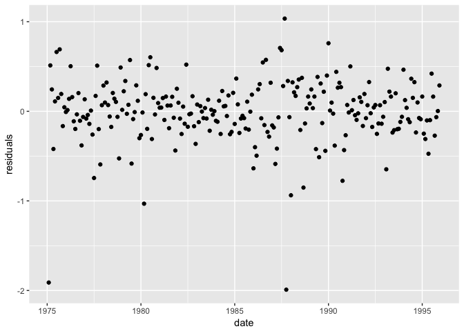
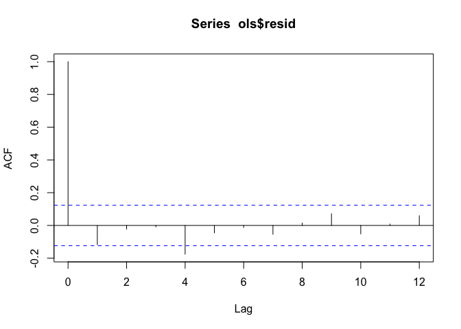

Ordinary Least Square estimations
================

-   [Introduction](#introduction)
-   [Simple Ordinary Least Square](#simple-ordinary-least-square)
-   [Multiple OLS](#multiple-ols)
-   [Wald F test](#wald-f-test)

### Introduction

In this tutorial, we deal with the regression models in time series by ordinary least square. In time series OLS, it is often important to appropriately adjust the standard error since it is common that data has autocorrelation or heteroscedasitity. Wald F test is used instead of standard F test to examine a linear combination of variables. This is a method to incorporate the heteroscedasticity or autocorrelation to a standard F test.

``` r
library(magrittr)
library(tidyverse)
library(xts)
```

### Simple Ordinary Least Square

At first, we consider simple ordinary least square, where we regress first order difference of spread onto first order difference of call rate. Let *Δ**y*<sub>*t*</sub> represent `spread` and *Δ**x*<sub>*t*</sub> a vector of 1s and `call`, then the model to estimate is

where *δ* = (*δ*<sub>1</sub>, *δ*<sub>2</sub>)′ is a vector of coefficient and *ϵ*<sub>*t*</sub> is assumed to be i.i.d.

#### OLS estimation

In R, `lm` command fits linear models to estimate the coefficients. Note `lm` constructs standard error under the assumption that residuals are i.i.d.

``` r
diffsXts<- readRDS("~/Documents/GitHub/Applied_TimeSeries_Analysis/dat/diffsXts.rds")
ols<- lm(spread_diff~call_diff, data=diffsXts)
summary(ols)$coef
```

    ##                 Estimate Std. Error     t value     Pr(>|t|)
    ## (Intercept) -0.008817292 0.02209268  -0.3991047 6.901581e-01
    ## call_diff   -0.582788034 0.05723238 -10.1828369 1.385217e-20

Intercept turns out to be insignificant but `call_diff` is signigicant in 0.1% level indicationg it is important in predicting spread. Notice, however, that we constructed standard error assuming homogeneity, which is a speacial case in economic/financial data. To see if this assumption is satisfied, we plot the residuals of the OLS model.

``` r
ggplot() + 
  geom_point(aes(index(diffsXts), resid(ols))) +
  labs(x="date", y="residuals")
```



It seems that there is a period of high diviation (e.g. late 80s) and low diviation (e.g. 83-85). This is a typical characteristic in financial and economic series called volatility clustering.

#### Heteroscedasticity consistent standard error

Now, we adjust the standard error to be robust to heterogeneous distribution of residuals by modifying variance covariance matrix. `sandwich` and `lmtest` package offers flexible options for handling things like heteroscedasticity and autocorrelaiton.

``` r
lmtest::coeftest(ols, vcov.=sandwich::vcovHC)
```

    ## 
    ## t test of coefficients:
    ## 
    ##               Estimate Std. Error t value  Pr(>|t|)    
    ## (Intercept) -0.0088173  0.0232992 -0.3784    0.7054    
    ## call_diff   -0.5827880  0.0853499 -6.8282 6.535e-11 ***
    ## ---
    ## Signif. codes:  0 '***' 0.001 '**' 0.01 '*' 0.05 '.' 0.1 ' ' 1

The standard error is larger than homogenous-only SE, hence smaller p-value. Nonetheless, `call_diff` is significant in 0.1% level.

#### Heteroscedasticity and autocorrelation consistent satandard error

Another commonly used standard error is HAC (heteroscedasticity and autocorrelation consistent) estimator. This is an extension of HC estimator above to adjust not only to heteroscedasticity but also autocorrelation. Here, we use HAC proposed by Newey and West (1987), which R provides as `sandwich::NeweyWest`.

``` r
lmtest::coeftest(ols, vcov.=sandwich::NeweyWest)
```

    ## 
    ## t test of coefficients:
    ## 
    ##               Estimate Std. Error t value  Pr(>|t|)    
    ## (Intercept) -0.0088173  0.0186908 -0.4717    0.6375    
    ## call_diff   -0.5827880  0.0750523 -7.7651 2.122e-13 ***
    ## ---
    ## Signif. codes:  0 '***' 0.001 '**' 0.01 '*' 0.05 '.' 0.1 ' ' 1

``` r
sandwich::bwNeweyWest(ols)
```

    ## [1] 1.588129

The default kernel is `Bertlett`. The bandwidth to be selected is 1.59 and the result is more or less similar to the one by HC estimation.

#### Autocorrelation test for model residuals

To determine whether to consider autocorrelation, we examine the autocorrelation in the residuals. First, we draw autocorrelation correlation function using R's `acf` command.

``` r
acf(ols$resid, lag.max = 12)
```



Only lag four (and parhaps lag one) exceeds the threshold, but we cannot entirely sure if serial correlation exists. Next, we see whether a group of autocorrelations is significantly different from zero, using Ljung-Box test. We consider groups of 1, 2, 6 and 12 lags.

``` r
for (i in c(1,2,6,12)){
  print(Box.test(ols$resid, lag=i, type='L'))
}
```

    ## 
    ##  Box-Ljung test
    ## 
    ## data:  ols$resid
    ## X-squared = 3.5232, df = 1, p-value = 0.06051
    ## 
    ## 
    ##  Box-Ljung test
    ## 
    ## data:  ols$resid
    ## X-squared = 3.6524, df = 2, p-value = 0.161
    ## 
    ## 
    ##  Box-Ljung test
    ## 
    ## data:  ols$resid
    ## X-squared = 12.158, df = 6, p-value = 0.05854
    ## 
    ## 
    ##  Box-Ljung test
    ## 
    ## data:  ols$resid
    ## X-squared = 15.938, df = 12, p-value = 0.1941

In all groups considered, the tests fail to reject the null hypothesis of no sereal dependencies at 5% signicicance level.

### Multiple OLS

We consider a multiple OLS by adding call rate of *t* − 1 and *t* − 2 periods. Hence *Δ**x*<sub>*t*</sub> in Equation 1 is now a vector of four length; 1s, call rate at period *t*, *t* − 1 and *t* − 2.

First, as we did in the simple OLS, we estimate the coefficients under homoscedasticity assumption.

``` r
ols_m<-lm(spread_diff~call_diff+lag(call_diff)+lag(call_diff,2), data=diffsXts)
summary(ols_m)$coef
```

    ##                       Estimate Std. Error    t value     Pr(>|t|)
    ## (Intercept)       -0.004076537 0.02088289 -0.1952094 8.453908e-01
    ## call_diff         -0.532698427 0.05773703 -9.2262873 1.352519e-17
    ## lag(call_diff)    -0.100771374 0.06079976 -1.6574304 9.871239e-02
    ## lag(call_diff, 2)  0.034576468 0.05760322  0.6002524 5.488929e-01

The result shows that the lagged variables are not significant at 5% level and coefficient for `call_diff` doesn't change much when lags are included. Note that you can change the standard error to HC or HAC as we did in the simple OLS (results omitted)

### Wald F test

F test provides a joint test of multiple linear restrictions about the coefficitet. Wald F test is an extension of F test that incorporates heteroscedasticity and autocorrelation. (see p.205 of Hamilton (1994) for more)
As examples, we test two null hypothesis; (i) $\_2 = \_3 = \_4=0 $ and (ii) $\\hat \\delta\_3 + \\hat \\delta\_4=0$.

I first create a function (`WaldFstat`) which returns the Wald F statistics. This follows chi-squared distribution with degrees of dreedom being the number of restrictions. In put arguments are R (m\*k matrix or vector of length k), beta (a set of coef), r (m\*1 vector or scaler of values that we believe these liear combinations take on), vcov (variance covariance matrix) and q (number of restrictions).

``` r
waldFstat=function(R, beta, r, vcov,q){
  Fstat=(t(R%*%beta-r) %*% solve(R%*%vcov%*%t(R)) %*% (R%*%beta-r))/q 
  print(Fstat[1,1])
}
```

(i) $\_2 = \_3 = \_4=0 $

``` r
R=matrix(c(0,1,0,0, 0,0,1,0, 0,0,0,1),ncol=4, byrow=T)
beta=matrix(coef(ols_m))
r=matrix(c(0,0,0))
vcov=sandwich::vcovHAC(ols_m)
q=3
waldFstat(R, beta, r, vcov,q)
```

    ## [1] 23.48306

``` r
qf(0.95,q,Inf) # critical value
```

    ## [1] 2.604909

(ii) $\\hat \\delta\_3 + \\hat \\delta\_4=0$

``` r
R=matrix(c(0,0,1,1), nrow=1,byrow=T)
beta= matrix(coef(ols_m))
r=0
vcov=sandwich::vcovHAC(ols_m)
q=1
waldFstat(R,beta, r, vcov,q)
```

    ## [1] 0.9987685

``` r
qf(0.95,q,Inf)
```

    ## [1] 3.841459

The results reject the null hypothesis in (i) but doesn't in (ii), the expected result from the multiple linear regression.
